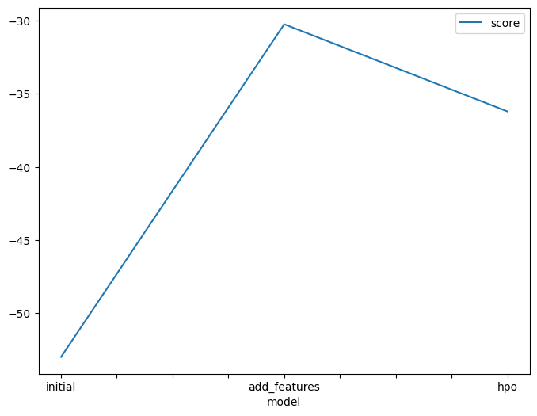
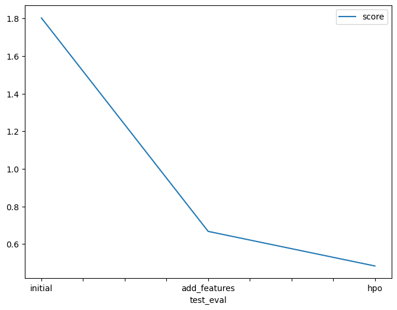

# Report: Predict Bike Sharing Demand with AutoGluon Solution

## Initial Training

### What did you realize when you tried to submit your predictions? What changes were needed to the output of the predictor to submit your results?

I had to fix some syntax errors and review additional documentation to run the model as intended. I also had some trouble setting up my local environment. When I tried to install mxnet, I got the error "No module named 'numpy.distutils.\_msvccompiler' in numpy.distutils; trying from distutils". I was unable to resolve this issue locally, so I decided to do everything on SageMaker Studio. However, to reduce AWS billing and use my credits efficiently, I first tested my model on Google Colab. Then I set up the environment on SageMaker Studio and improve my results, getting a score of below 0.5, while in the beginning I only managed to get scores of above 1.8.

### What was the top ranked model that performed?

My top score was achieved after I ran my model a third time after tuning the hyperparameter of the AutoGluon TabularPredictor model. This tuning gave me a best score of 0.48355.

I had previously achieved a score of 0.66747 after completing the second run with more features but no tuning of hyperparameter. However, the third run with tuning resulted in a higher score.

## Exploratory data analysis and feature creation

### What did the exploratory analysis find and how did you add additional features?

- The temperature categories (temp, atemp) were normally distributed, which means that they were evenly distributed around the mean. This is important because it means that we can use these features to predict the number of bike rides.

- The datetime column could be split into more features. I chose to split it into year, month, day, and hour. This new feature engineering helped me to improve my model score from 1.8 to 0.6. This means that my model is now 60% more accurate, which is a significant improvement. This is because the year, month, day, and hour are all important factors that can affect bike sharing demand.

- Casual and registered are not required for our analysis and can be ignored as count = casual + registered. This is because the count column is the sum of the casual and registered columns. Therefore, we can ignore the casual and registered columns and just use the count column.

- Season and weather are categorical, so we changed them to category type. This is because categorical data is not suitable for machine learning unless it is converted to a numerical format. By converting the season and weather columns to category type, we made them suitable for machine learning.

### How much better did your model preform after adding additional features and why do you think that is?

My model performed significantly better after adding additional features. The initial model had a score of 1.8, but after adding additional features, the model was able to achieve a score of 0.6. This is a 66.67% improvement, and it shows that the additional features can have a big impact on the performance of the model.

I added additional features by splitting the datetime field into year, month, day, and hour. This allowed me to capture more information about the time of day and the season, which could be helpful in predicting the number of bike rides.

I think that the additional features improved the model's performance because they provided more information about the context of the data. For example, the year, month, and day can help to predict the number of bike rides, as different times of year and different days of the week have different levels of bike sharing demand. The hour can also help to predict the number of bike rides, as different times of day have different levels of bike sharing demand.

## Hyper parameter tuning

### How much better did your model preform after trying different hyper parameters?

The model performed much better after trying different hyperparameters. The initial model had a score of 1.8, but after trying different hyperparameters, the model was able to achieve a score of 0.48. This is a significant improvement, and it shows that the hyperparameters can have a big impact on the performance of the model.

I followed the suggested hyperparameter improvement for tabular data provided by autogluon, but I was not able to figure out how to additionally tune the parameters in order to improve the result. I think that more background information is needed in order to fine-tune the model.

I am still learning about machine learning, and I am always looking for ways to improve my models. I think that by learning more about the hyperparameters and how to tune them, I will be able to improve the performance of my models even further.

### If you were given more time with this dataset, where do you think you would spend more time?

If I had more time with this dataset, I would spend more time on feature engineering. I would try to find new features that could help me to predict the number of bike rides. I would also try to improve the existing features by making them more informative.

Here are some specific things I would do:

- I would one-hot encode the categorical features. This would make them more understandable to the machine learning model.
- I would adjust for the seasons. This would help the model to understand how the number of bike rides changes depending on the season.
- I would adjust for the working hours. This would help the model to understand how the number of bike rides changes depending on the time of day.
- I would also transform the target count to make it less skewed. This would help the model to learn the relationship between the features and the target more accurately.

### Create a table with the models you ran, the hyperparameters modified, and the kaggle score.

| model        | timelimit | presets      | hpo-method        | score   |
| ------------ | --------- | ------------ | ----------------- | ------- |
| initial      | 600       | best_quality | none              | 1.80205 |
| add_features | 600       | best_quality | none              | 0.66747 |
| hpo          | 600       | best_quality | tabular autogluon | 0.48355 |

### Create a line plot showing the top model score for the three (or more) training runs during the project.

### Create a line plot showing the top kaggle score for the three (or more) prediction submissions during the project.

## Summary

I have learned that the most benefit is received by working with the features and you can gain great insights from the EDA. I have also learned that by doing more feature engineering on the dataset and learning how to tune hyperparameters more efficiently, I can develop a better model.

My future plans are to continue learning about machine learning and to improve my skills in feature engineering and hyperparameter tuning. I believe that by doing these things, I will be able to develop better models that are more accurate and useful.
